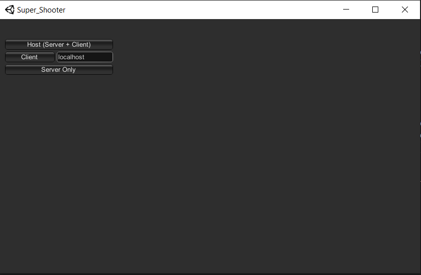
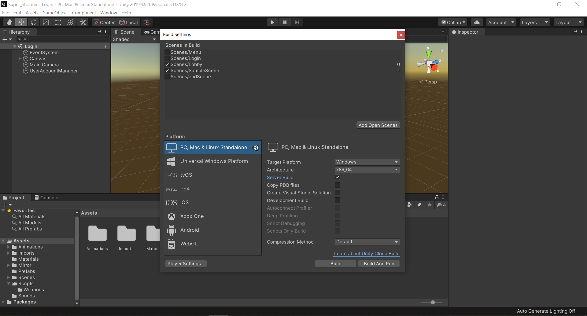
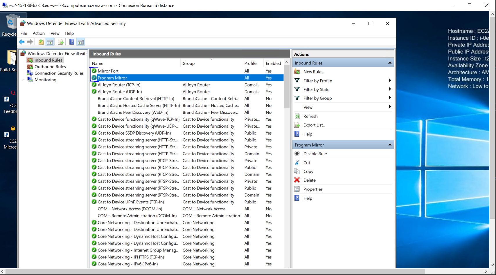
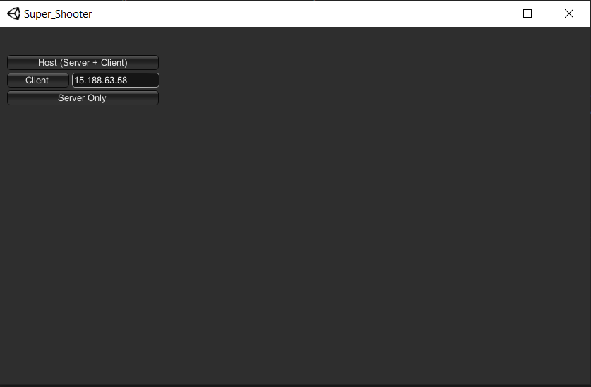
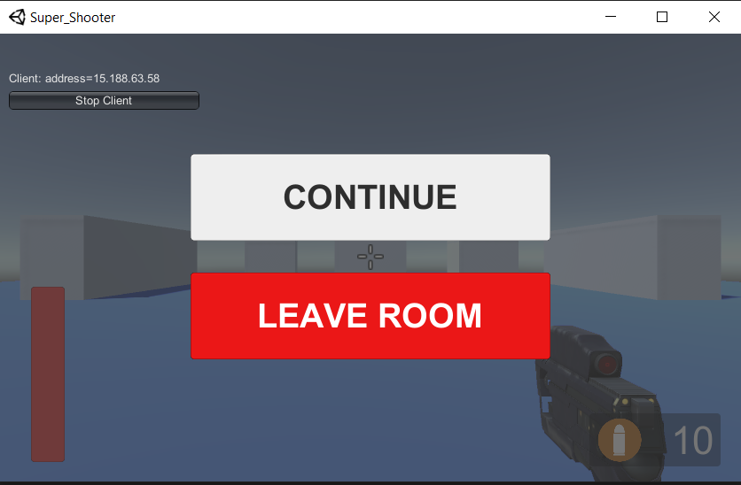

# README - Jeu vidéo à la première personne 1v1

Bienvenue dans ce jeu vidéo à la première personne 1v1 ! Avant de commencer, assurez-vous de télécharger la dernière release disponible.

## Contrôles

Les contrôles du jeu sont les suivants :

- `z` pour avancer
- `q` pour aller à gauche
- `s` pour reculer
- `d` pour aller à droite
- Cliquez sur le bouton gauche de la souris pour tirer

## Connexion en localhost

Pour jouer en mode local, cliquez sur `Host (Server + Client)` pour créer le serveur et vous connecter. Si le serveur est déjà créé, cliquez sur `Client` en vérifiant bien que `localhost` est sélectionné.

## Connexion à un serveur distant

Si vous souhaitez jouer sur un serveur distant, vous devez créer un build serveur. Pensez à bien décocher la scène "lobby" qui ne comporte pas le NetworkManager, sinon vous risquez de rencontrer quelques soucis. N'oubliez pas de cocher "Server Build" comme indiqué sur l'image ci-dessous.

Assurez-vous également d'avoir activé une autorisation dans le firewall permettant de se connecter au port `7777` en UDP, qui est le port de Mirror par défaut et de bien autorisé dans le firewall le fichier .exe du build du serveur permettant de le lancer.

Une fois le build du serveur exécuté sur le serveur, au lieu de `localhost` dans `Client`, entrez directement l'adresse IP publique du serveur pour vous connecter.

Une vidéo de démonstration est disponible sur YouTube (https://youtu.be/xTL5gOBJcEo).

## Aperçu du jeu

Une image en jeu est disponible ci-dessous pour vous montrer à quoi ressemble le jeu.

